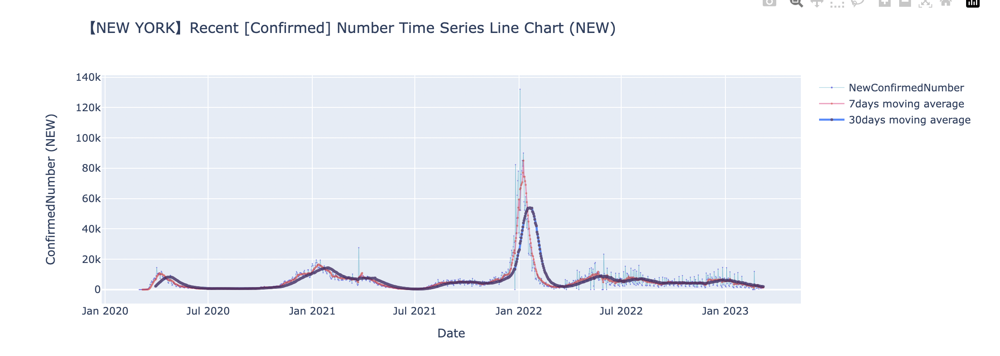
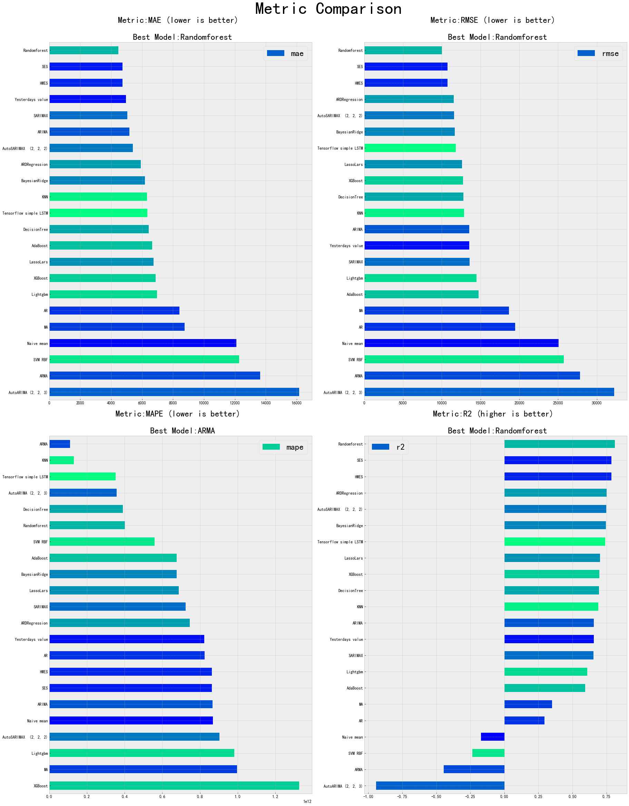
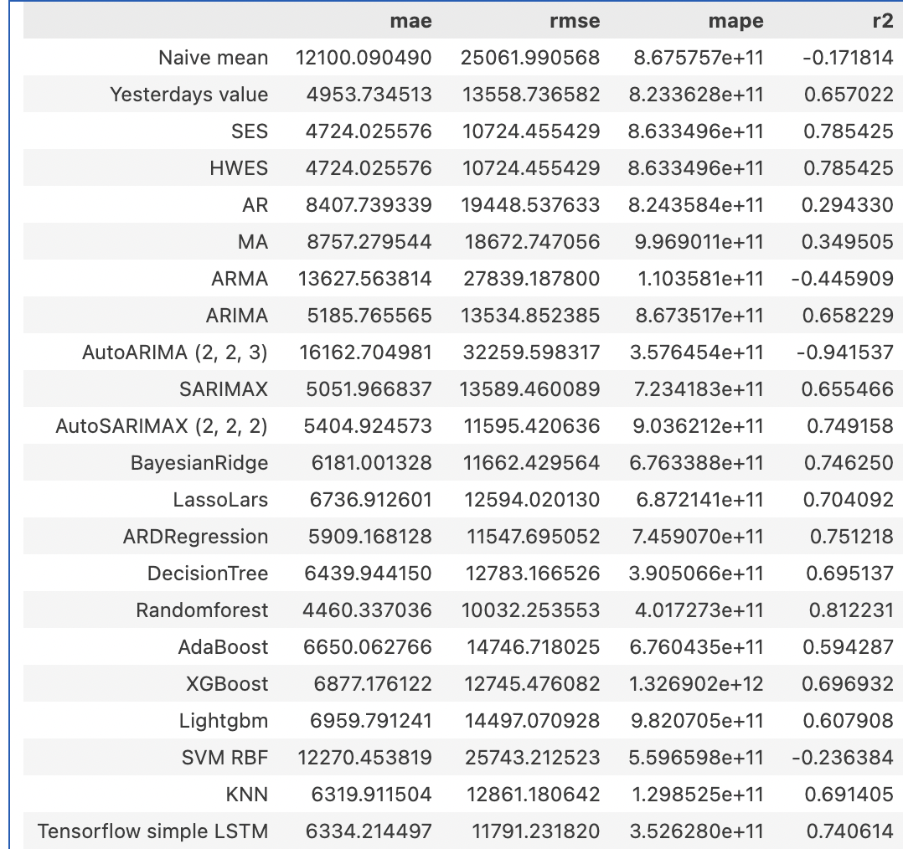

# Time Series Forecasting Project Overview

This project explores various techniques for time series forecasting, structured into several notebooks each focusing on different aspects of the process.

## Programming Languages
 **Python** 

## Models Used
- ARIMA, SARIMA, LSTM networks, Random Forest among others, chosen based on data characteristics and objectives.

## Notebooks Overview

### 1. Data Processing (`1. Data_Processing.ipynb`)
- **Focus**: Initial data handling includes cleaning, normalization and trend detection, preparing the groundwork for in-depth time series analysis.

### 2. Data Analysis (`2. Data_Analysis.ipynb`)
- **Focus**: Statistical analysis and visualizations to understand data characteristics.

### 3. Time Series Basis (`3. TimeSeriesBasis.ipynb`)
- **Focus**: Introduction to core concepts using techniques like decomposition to identify seasonality and trend components within the data.

### 4. Univariate Time Series Forecasting (`4. UnivariateTimeSeriesForecasting.ipynb`)
- **Focus**: Utilization of ARIMA and SARIMA models, focusing on their application to predict future data points in a univariate context.

### 5. Multivariate Time Series Forecasting (`5. MultivariateTimeSeriesForecasting.ipynb`)
- **Focus**: Deployment of sophisticated models such as Vector Autoregression (VAR), Long Short-Term Memory (LSTM), Random Forest networks to forecast multiple interdependent time series data.

## Additional Components

- **Data Overview and Visualization (`DataOverview_visualization.ipynb`)**: - Extensive use of plotting for data exploration and result presentation. Custom metrics module (`metrics.py`) for performance evaluation, highlighting accuracy, and model comparison.
- **Metrics Module (`metrics.py`)**: Custom Python module for model performance evaluation.

## Visualizations
- Emphasis on visual insights including time series plots, decomposition charts, and prediction accuracy.
)](pictures/newyork.png)

## result
A comprehensive application of time series forecasting methods from data preprocessing to advanced multivariate analysis, supported by detailed visualizations.

